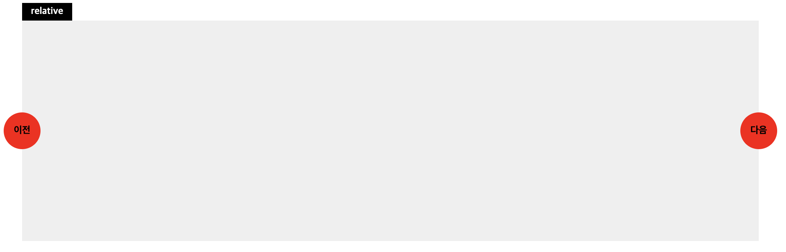

## Position

### MDN Guide (https://developer.mozilla.org/ko/docs/Web/CSS/position)

### 설명

CSS position 속성은 문서 상에 요소를 배치하는 방법을 지정합니다. top, right, bottom, left 속성이 요소를 배치할 최종 위치를 결정합니다.

---

### 예제 1

```html
<div class="area">
  <div class="box static">static 1</div>
  <div class="box static">static 2</div>
  <div class="box static">static 3</div>
</div>
```

일반적으로 div 요소는 display 속성이 block 이며 position 이 static 임으로 요소가 수직으로 나열됩니다.

```css
.area {
  position: relative;
}

.area box {
  position: absolute;
}

.area box:nth-child(1) {
  top: 0;
  left: 50px;
}

.area box:nth-child(2) {
  top: 0;
  right: 100px;
}

.area box:nth-child(3) {
  bottom: 20px;
  right: -50px;
}
```

area 요소에 position 을 relative 로 지정하고, 자식 요소인 box 요소에 absolute 를 지정하면
relative 영역 기준으로 absolute 요소는 자유롭게 위치를 지정 할 수 있습니다.
위치를 지정할때는 top, left, bottom, right 속성을 지정하여 위치를 지정 할 수 있습니다.

```html
<div class="area">
  <div class="box absolute">absolute 1</div>
  <div class="box absolute">absolute 2</div>
  <div class="box absolute">absolute 3</div>
</div>
```

```css
.area box:nth-child(4) {
  top: 0;
  left: 80px;
}
```

box 요소를 하나 더 추가하고 다른 박스와 겹치는 위치로 포지셔닝을 한다면 어떻게 될까요? 🧐 <br/>
이미 다른 요소가 있는 위치임에도 불구하고 겹쳐서 화면에 노출됩니다.

---

```html
<div class="area">
  <div class="box absolute">absolute 1</div>
  <div class="box absolute">absolute 2</div>
  <div class="box absolute">absolute 3</div>
  <div class="box absolute">absolute 4</div>
</div>
```

```css
.area box:nth-child(4) {
  top: 0;
  left: 80px;
}
```

---

또, top, left, right, bottom 을 지정할때 px 단위가 아닌 %, em, rem, vw, vh 등의 단위도 사용 가능합니다.
만약 % 단위를 사용했다면, relative 요소의 크기를 기준으로 absolute 요소의 위치를 계산하게 되는것이죠!

```html
<div class="area">
  <div class="box absolute">absolute 1</div>
</div>
```

```css
.area box {
  top: 0;
  left: 100%;
}
```

### 문제 1

아래 코드에서 흰색 박스 영역(Goal) 으로 absolute 박스를 위치시키려면 포지셔닝을 어떻게 해야할까요?
style.css 파일의 코드를 수정해서 absolute 박스가 가운데로 위치 할 수 있도록 수정해보세요!

- index.html 41번째 줄부터 코드 확인

```html
<section class="q-3">
  <div class="area relative">
    <span class="caption">relative</span>
    <div class="box center-goal">Goal</div>
    <div class="box absolute">absolute</div>
  </div>
</section>
```

<br>

---

### 문제 2

아래 화면은 엘리쌤의 영어강의를 표시하는 디자인입니다.
아이템에 구성되어있는 내용은 아래 3가지 입니다.
CSS position 을 사용해서 아래의 이미지와 똑같은 화면을 만들어보세요. <br/>

<small>(모든 레이아웃을 position으로 작성하는것이 아닌 position 을 필요한 부분에만 사용하는 문제입니다.)</small>

- 썸내일 이미지
- 좋아요 버튼
- 타이틀 텍스트


---

### 문제 3

아래 화면은 슬라이드의 이전/이후 버튼을 나타내는 디자인 입니다.<br/>
CSS position 을 사용해서 아래의 이미지와 똑같은 화면을 만들어보세요. <br/>
<small>(모든 레이아웃을 position으로 작성하는것이 아닌 position 을 필요한 부분에만 사용하는 문제입니다.)</small>


